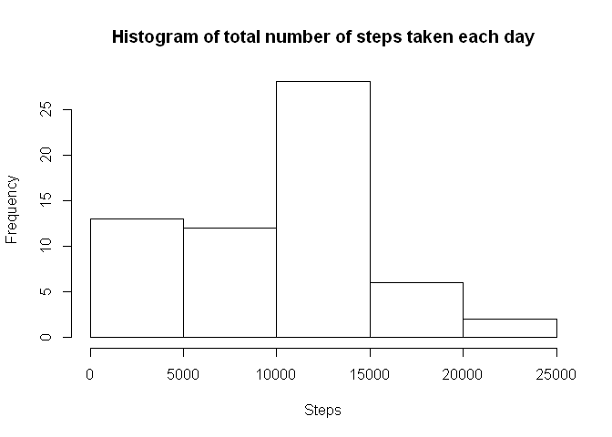
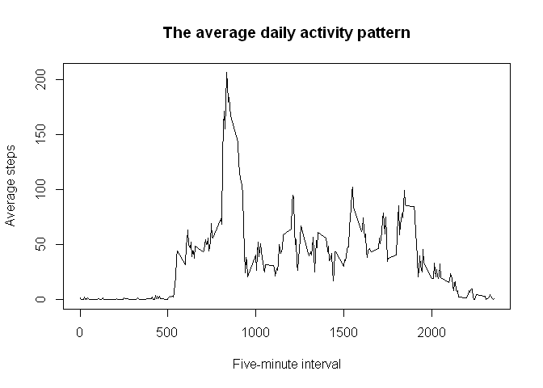
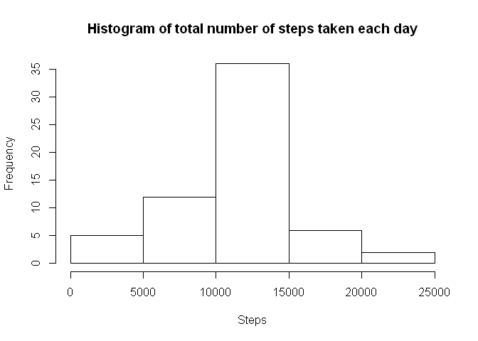
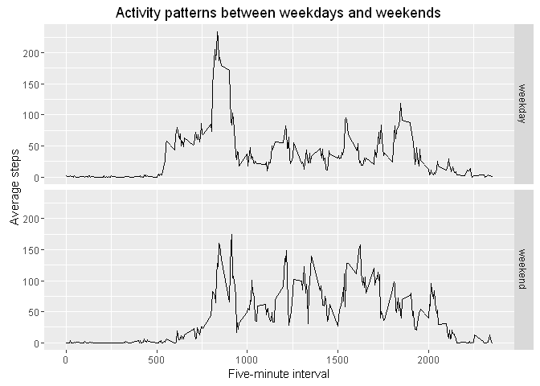

# Reproducible Research: Peer Assessment 1
Jianjun Luo  
Thursday, March 10, 2016  


## Loading and preprocessing the data
1. Load the data (i.e. read.csv())
2. Process/transform the data (if necessary) into a format suitable for your analysis


```r
rm(list=ls())
raw_file<-"activity.zip"
unzip(raw_file)
rawData<-read.csv("activity.csv",header=TRUE,na.strings="NA")
summary(rawData)
```

```
##      steps                date          interval     
##  Min.   :  0.00   2012-10-01:  288   Min.   :   0.0  
##  1st Qu.:  0.00   2012-10-02:  288   1st Qu.: 588.8  
##  Median :  0.00   2012-10-03:  288   Median :1177.5  
##  Mean   : 37.38   2012-10-04:  288   Mean   :1177.5  
##  3rd Qu.: 12.00   2012-10-05:  288   3rd Qu.:1766.2  
##  Max.   :806.00   2012-10-06:  288   Max.   :2355.0  
##  NA's   :2304     (Other)   :15840
```


## What is mean total number of steps taken per day?
1. Calculate the total number of steps taken per day
2. If you do not understand the difference between a histogram and a barplot, research the difference between them. Make a histogram of the total number of steps taken each day
3. Calculate and report the mean and median of the total number of steps taken per day


```r
dayData<-tapply(rawData$steps, rawData$date, sum, na.rm=TRUE)
hist(dayData, main="Histogram of total number of steps taken each day", xlab="Steps")
```

<!-- -->

```r
## the mean of the total number of steps taken per day 
mean_step<-as.integer(mean(dayData))
## the median of the total number of steps taken per day 
median_step<-as.integer(median(dayData))
```
The mean of total number of the steps taken per day is 9354  
The median of total number of the steps taken per day is 10395  


## What is the average daily activity pattern?
1. Make a time series plot (i.e. type = "l") of the 5-minute interval (x-axis) and the average number of steps taken, averaged across all days (y-axis)
2. Which 5-minute interval, on average across all the days in the dataset, contains the maximum number of steps?


```r
minuteData<-tapply(rawData$steps, rawData$interval, mean, na.rm=TRUE)
plot(names(minuteData),minuteData,type="l",xlab="Five-minute interval", ylab="Average steps", main="The average daily activity pattern")
```

<!-- -->

```r
max_step<-max(minuteData)
max_day<-names(which(minuteData==max_step))
```
In the 835 five minute interval, on  average across all the days in the dataset, contains the maximum number of steps 206.1698113


## Imputing missing values
1. Calculate and report the total number of missing values in the dataset (i.e. the total number of rows with NAs)
2. Devise a strategy for filling in all of the missing values in the dataset. The strategy does not need to be sophisticated. For example, you could use the mean/median for that day, or the mean for that 5-minute interval, etc.
3. Create a new dataset that is equal to the original dataset but with the missing data filled in.
4. Make a histogram of the total number of steps taken each day and Calculate and report the mean and median total number of steps taken per day. Do these values differ from the estimates from the first part of the assignment? What is the impact of imputing missing data on the estimates of the total daily number of steps?


```r
## missing values
missingData<-sum(is.na(rawData))
percent_mis<-missingData/nrow(rawData)
```
The total number of missing values in the dataset is 2304, which is 0.1311475 percentage of the whole dataset   


```r
## filling in missing values with the average step across all days
fillingData<-rawData
for (i in 1:nrow(rawData))
{
  if(is.na(fillingData$steps[i]))
  {
    fillingData$steps[i]<-minuteData[as.character(fillingData$interval[i])]  
  }
}
## check all the missing values has been filling 
sum(is.na(fillingData))
```

```
## [1] 0
```

```r
## total number of steps taken each day after filling
dayFillingData<-tapply(fillingData$steps, fillingData$date, sum)
hist(dayFillingData, main="Histogram of total number of steps taken each day", xlab="Steps")
```

<!-- -->

```r
## the mean of the total number of steps taken per day 
mean_step_filling<-as.integer(mean(dayFillingData))
## the median of the total number of steps taken per day 
median_step_filling<-as.integer(median(dayFillingData))
```
The mean of total number of the steps taken per day after filling is 10766  
The median of total number of the steps taken per day after filling is 10766  
Comparing with the mean (9354) and median (10395) before filling, we can see the mean and median of the total daily number of steps change only a little, given the strategy adopt for filling in all of the missing values in the dataset. A negligible increase on the estimate of the total daily number of steps comes from the replacement of the missing value with average steps within 5-minute interval.   


## Are there differences in activity patterns between weekdays and weekends?
1. Create a new factor variable in the dataset with two levels - "weekday" and "weekend" indicating whether a given date is a weekday or weekend day.
2. Make a panel plot containing a time series plot (i.e. type = "l") of the 5-minute interval (x-axis) and the average number of steps taken, averaged across all weekday days or weekend days (y-axis). See the README file in the GitHub repository to see an example of what this plot should look like using simulated data.


```r
library(ggplot2)
rawData$date<-as.Date(as.character(rawData$date))
rawData$week[weekdays(rawData$date) %in% c("Sunday","Saturday" )]<-"weekend"
rawData$week[!weekdays(rawData$date) %in% c("Sunday","Saturday" )]<-"weekday"
rawData$week<-as.factor(rawData$week)
weekData<-aggregate(steps ~ interval + week, data=rawData, mean, na.rm=TRUE)
ggplot(weekData, aes(interval,steps))+geom_line()+facet_grid(week ~.)+labs(x="Five-minute interval")+labs(y="Average steps")+labs(title="Activity patterns between weekdays and weekends")
```

<!-- -->

From the plots, we can see the activity patterns between weekdays and weekends are a little different. The average steps in weekday have highest value in the morning and then decrease to a relatively lower values. In weekend the average steps are not so high in the early morning as that in weekday and the up and down pattern continue for the daytimes. However, both weekday and weekend have similar pattern in the night after people when to bed. 
